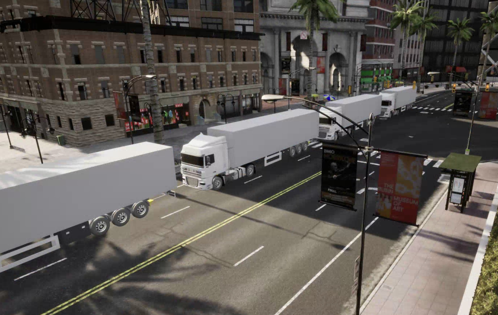

# AACD

AACD is an open-source, <span style="color: blue">agent-based</span> <span style="color: red">asynchronous</span> framework for simulating realistic inconsistencies in cooperative driving scenarios. It is built upon the [CARLA](https://github.com/carla-simulator/carla/) simulator and is designed to enable asynchronous updates for traffic agents and the simulator to more closely emulate real-world conditions.
## Features
* **Asynchronous Updates**: Simulate the dynamic and inconsistent nature of real-world traffic with asynchronous updates


* **Agent-based Design**: Each traffic agent operates independently, allowing for a scalable and flexible simulation environment.
  


* **Highly Extensible**: The modular design of AACD allows for easy integration and testing of custom algorithms.
Realistic Platooning System: Included is an implementation of a platooning system to demonstrate the framework's capabilities.


## Carla_Truck_Platoon
A full stack Platoon framework for Semi-Trailer Truck in Carla Simulation
(**For the first time a packaged version of CARLA with semi-tailer capability**)

Packaged version of carla with semi-trailer vehicle is released at google drive: 
https://drive.google.com/file/d/1TNenSlMxyTfZH50XkhW2_fQShRyXXgSt/view?usp=sharing



## Quick start
```
pip install -r requirements.txt
cd src
python3 setup.py build_ext --inplace
python3 main.py --log console --debug platoon   
```
